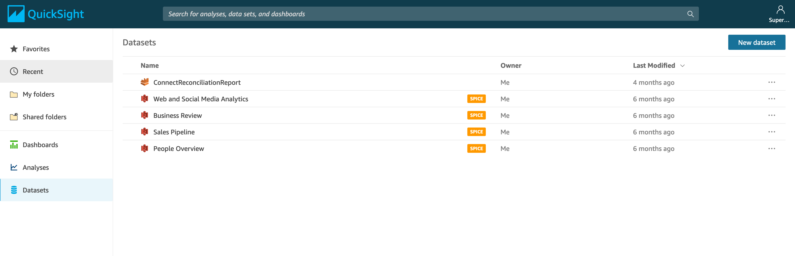
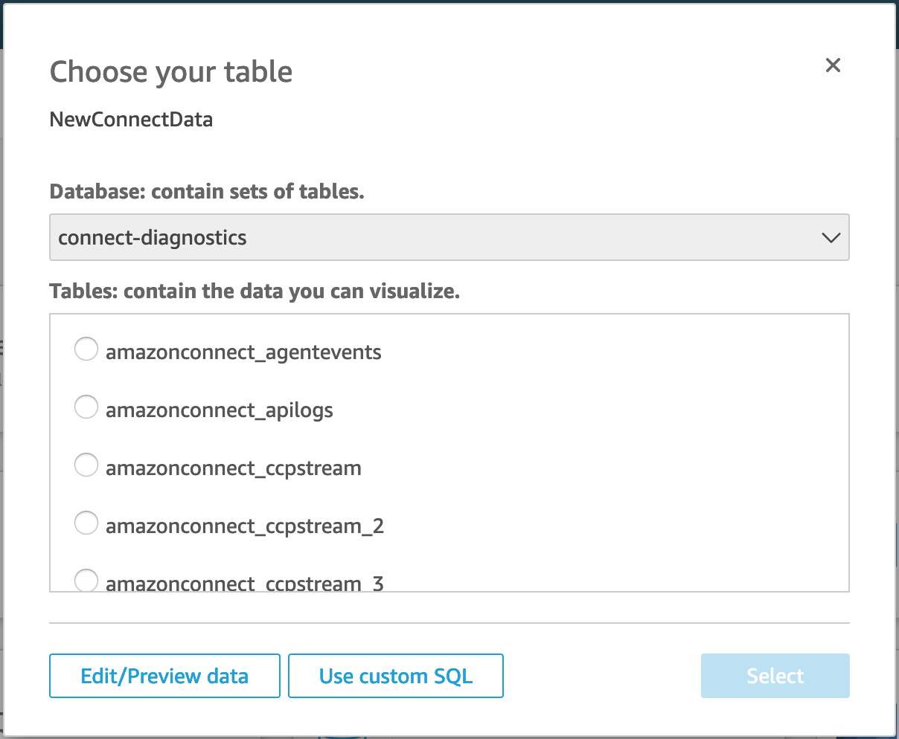
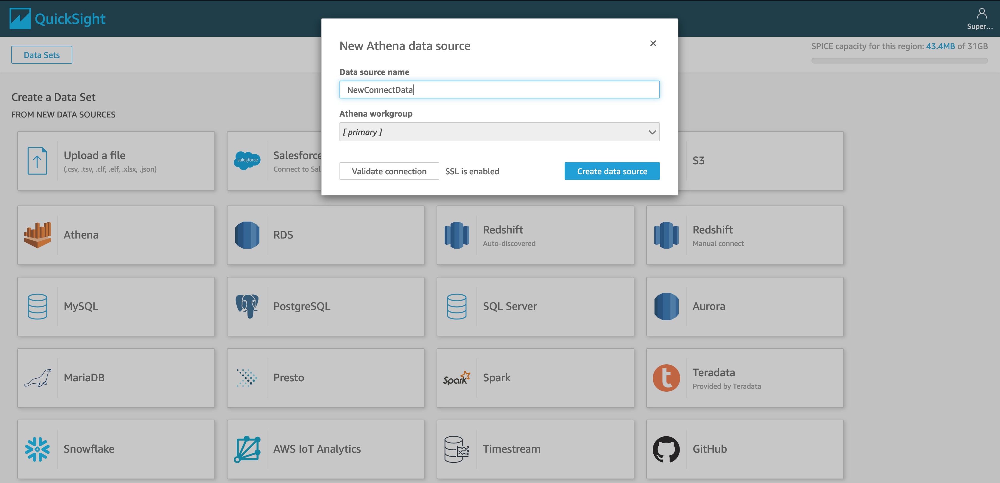
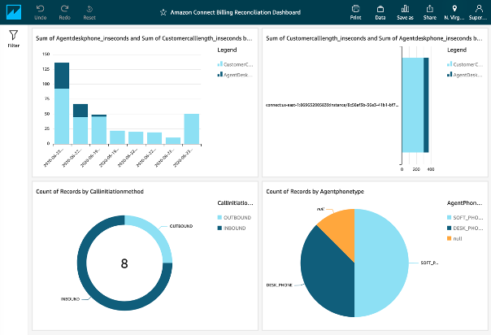

# Advanced usage analytics on Amazon Connect

This repository contains the AWS Cloudformation templates, Amazon Athena Queries and other artifacts used in the Analyzing Amazon Connect usage with agent desktop and streaming data blog post. 

For detailed starter project overview and deployment steps please refer to the blog.

Below outlines the optional step of setting up an Amazon Quicksight visualization. 

## Optional - Setting up Amazon Quicksight

1. Add New Data Source

    * In Quicksight, select *Datasets* on the left navigation pane.  Select *New dataset* on the next screen.

2. Select Athena as your new data set source and name your data set.

3. Select the database deployed by the previous section.  By default, it is *connect-analytics*. Then select “Use Custom SQL”

4. Paste in Query of your choice to create a new, dynamic data set for visualizations based on the attributes included in the SQL output.

## Security

See [CONTRIBUTING](CONTRIBUTING.md#security-issue-notifications) for more information.

## License

This library is licensed under the MIT-0 License. See the LICENSE file.